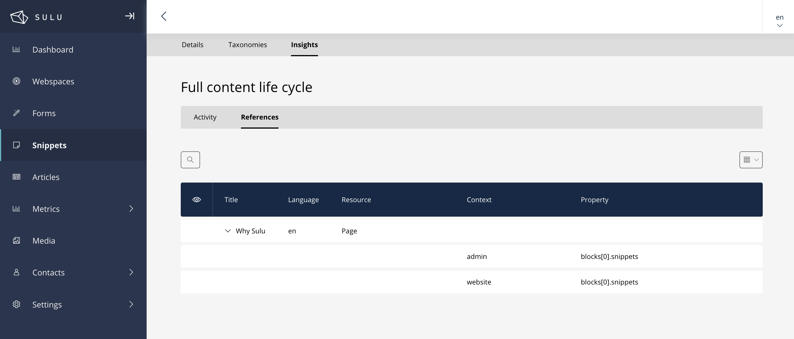

ReferenceBundle
===============

The ReferenceBundle is tasked with tracking references among entities within the application.
It enables developers and maintainers to quickly determine the relationships between entities and understand the manner
and location in which an entity is utilized. Presently, the ReferenceBundle is capable of monitoring the usage of Snippets and
Media within PHPCR entities such as `pages` and `snippets`. These references are managed distinctly for the draft
state within the `admin context` and the live state within the `website context`.

|

Content maintainers are able to see the references to a specific entity in the `Insights` tab of an entity like `Snippet`.

    Snippet References

Refresh references
------------------

The references are automatically updated upon saving an entity. You also have the option to manually update the
references by executing the `bin/console sulu:references:refresh` command. This command optionally accepts the
<resource-key> argument. When this argument is provided, only the references for the specified resource key will be refreshed.

.. code-block:: bash

    bin/console sulu:references:refresh <resource-key>

.. note::

    Please note that references are only refreshed for the current context. To refresh the references for both the
    admin and website contexts, you will need to execute the command twice via the `bin/adminconsole` and the `bin/websiteconsole`.

Integrating references for custom content-types
-----------------------------------------------

To integrate the ReferenceBundle for custom content-types, you need to implement the `ReferenceContentTypeInterface` in your
content-type class. The interface requires you to implement the `getReferences` method. The method already receives the
`ReferenceCollector` which you can use to add references to the collector.

|

Example implementation for a custom content-type:

.. code-block:: php

        public function getReferences(PropertyInterface $property, ReferenceCollectorInterface $referenceCollector, string $propertyPrefix = ''): void
        {
            $data = $property->getValue();
            if (!\is_array($data) || !isset($data['id'])) {
                return;
            }

            $referenceCollector->addReference(
                CustomEntity::RESOURCE_KEY,
                (string) $data['id'],
                $propertyPrefix . $property->getName()
            );
    }